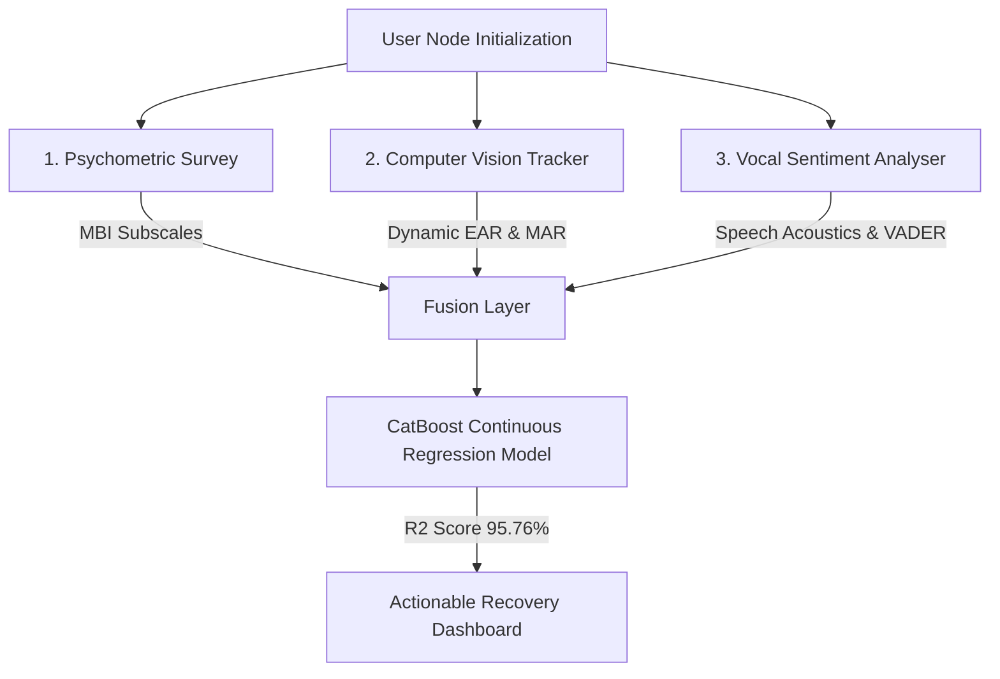

# MindHaven — AI-Powered Multi-Modal Burnout Detection Suite

<div align="center">


**A scientific, multi-modal diagnostic application combining psychometric evaluation, computer vision-based fatigue aspect ratios, and acoustic speech sentiment to assess student burnout on a continuous scale.**

[Live Application](https://mind-haven-zeta.vercel.app) • [Research Methodology](frontend/about.html) • [Database Console](https://supabase.com) • [Hugging Face Space API](https://kritika53245-mindhaven.hf.space)

</div>

---

## ─── 🧬 Technical Architecture & Multi-Modal Fusion ───

MindHaven operates on a **Late-Fusion Hybrid Model** combining three primary input streams to achieve objective, unbiased burnout scores. It replaces subjective, self-reporting biases with real-time biometric indicators:



### 1. Psychometric Survey Module
Evaluates mental clarity, exhaustion, and motivation using a 5-question baseline mapped closely to the **Maslach Burnout Inventory (MBI)**.

### 2. Computer Vision Pipeline (Facial Geometry & Emotion Recognition)
Uses a camera capture feed (utilizing MediaPipe landmark tracking and DeepFace classifier models) to extract biometric physical fatigue markers and real-time emotional state signatures:
*   **Facial Emotion Classifier (DeepFace)**: Evaluates dynamic micro-expressions and categorizes facial signals into positive, neutral, or negative emotion matrices.
*   **Eye Aspect Ratio (EAR)**: Computes eye fatigue and blink duration based on vertical and horizontal eye landmark distances. An EAR drop below `0.2` indicates micro-napping/exhaustion.
*   **Mouth Aspect Ratio (MAR)**: Measures jaw tension and yawning frequencies.

$$\text{EAR} = \frac{||P_2 - P_6|| + ||P_3 - P_5||}{2 ||P_1 - P_4||}$$

$$\text{MAR} = \frac{\text{INNER\_MOUTH\_HEIGHT}}{\text{INNER\_MOUTH\_WIDTH}}$$

### 3. Vocal & Sentiment Channel
Captures verbal responses using the browser's WebRTC API and AudioContext. It transcribes natural speech and executes sentiment analysis via the **VADER (Valence Aware Dictionary and sEntiment Reasoner)** library, extracting a normalized compound sentiment score ranging from `-1.0` (highly stressed) to `1.0` (optimal stability).

---

## ─── 📊 Model Evaluation & Benchmarks ───

The core diagnostic engine utilizes a **CatBoost Regressor** predicting a continuous burnout index from `0.0` (Low) to `4.0` (Severe). The model was trained directly on VIT Bhopal student survey datasets under strict 5-Fold Cross-Validation:

| Metric | Support Vector Regressor (SVR) | Random Forest Regressor | CatBoost Regressor (Ours) |
| :--- | :---: | :---: | :---: |
| **Mean R² Score** | 92.95% | 95.32% | **95.76%** |
| **Mean RMSE** | 0.2227 | 0.1805 | **0.1727** |
| **Mean MAE** | 0.1719 | 0.1444 | **0.1378** |

*All evaluations utilize a continuous target derived directly from participant questionnaire dimensions and facial geometry to prevent classification boundary discretization errors.*

---

## ─── 💾 Database Schema (Supabase) ───

MindHaven connects directly to a secure PostgreSQL database on Supabase to store authentication profiles and persistent assessment telemetry.

### Table: `assessments`
Stores historical metrics, enabling Chart.js graphs and the trend analysis panel:

| Column Name | Type | Description |
| :--- | :--- | :--- |
| `id` | `uuid` (PK) | Unique identifier for the assessment. |
| `user_id` | `uuid` (FK) | Maps to `auth.users` schema. |
| `burnout_score` | `numeric` | Final calculated burnout regression score (0.0 to 4.0). |
| `suggestion` | `text` | Recommended coping actions and therapeutic activities. |
| `ear` | `numeric` | Average Eye Aspect Ratio tracked during scan. |
| `mar` | `numeric` | Average Mouth Aspect Ratio / yawning index. |
| `emo_pos` | `numeric` | Cumulative positive facial expression percentage. |
| `emo_neu` | `numeric` | Cumulative neutral facial expression percentage. |
| `emo_neg` | `numeric` | Cumulative negative facial expression percentage. |
| `sentiment_compound` | `numeric` | Speech transcript sentiment polarity compound score (-1 to 1). |
| `voice_transcript` | `text` | Speech-to-text transcript of user voice query. |
| `created_at` | `timestamptz` | Generation timestamp. |

---

## ─── 📁 Project Layout & Directory Structure ───

```
MindHaven/
├── frontend/               # Client-Side Application
│   ├── css/                # Custom CSS styling stylesheets
│   ├── js/                 # JavaScript scripts
│   │   ├── 3d-elements.js  # Three.js 3D background elements
│   │   ├── config.js       # Git-ignored local configuration overrides
│   │   ├── theme.js        # Light/dark UI mode toggling
│   │   └── utils.js        # Shared database hooks and default configurations
│   ├── index.html          # Wellness home page portal
│   ├── auth.html           # Authentication portal
│   ├── assess.html         # Multimodal capture interface
│   ├── insights.html       # AI Coach advisor panel
│   ├── dashboard.html      # Recovery tracking dashboard
│   └── about.html          # Scientific methodology
├── backend/                # Production Hugging Face Container API
│   ├── Dockerfile          # HF Docker definition
│   ├── main.py             # FastAPI regression inference service
│   ├── model.joblib        # Pre-trained CatBoostRegressor model
│   ├── scaler.joblib       # Standard Scaler artifact
│   └── requirements.txt    # Production dependencies
├── model_training/         # Notebooks and empirical data
│   ├── data.csv            # Empirically collected VIT student burnout data
│   ├── Model_Training_Regression.ipynb # Fully-executed training pipeline
│   └── regression_output/  # Serialized model export directory
└── chatbot_finetuning/     # Cognitive Behavioral Therapy Fine-Tuning
    └── MindHaven_CBT_FineTuning.ipynb
```

---

## ─── 🛠️ Local Setup & Configuration ───

### Secure Environment Setup
MindHaven prevents API keys from leaking to version control. The client keys are resolved from the git-ignored configuration:

1. Create a `config.js` file inside `frontend/js/`:
   ```javascript
   // frontend/js/config.js
   window.MINDHAVEN_CONFIG = {
     GROQ_KEY: "gsk_your_private_groq_api_key_here",
     API_URL: "https://kritika53245-mindhaven.hf.space/predict" // Optional override
   };
   ```
2. Make sure `config.js` is ignored in Git:
   ```bash
   # .gitignore
   frontend/js/config.js
   ```

### Running the Application
Serve the files locally using any simple HTTP server:
```bash
# Serve via Python
cd frontend
python -m http.server 8000
```
Open your browser at `http://localhost:8000`.

---

## ─── 🚀 Deployment ───

### Frontend
Deployed globally to production on **Vercel** via serverless builds. To deploy updates:
```bash
cd frontend
npx vercel --prod
```
The active live distribution domain is: **[https://mind-haven-zeta.vercel.app](https://mind-haven-zeta.vercel.app)**.

### Hugging Face Space (Backend API)
The backend container runs on a Hugging Face Space built from the [backend/](backend) folder configuration. 

The API endpoints are exposed at: **[https://kritika53245-mindhaven.hf.space](https://kritika53245-mindhaven.hf.space)**.
