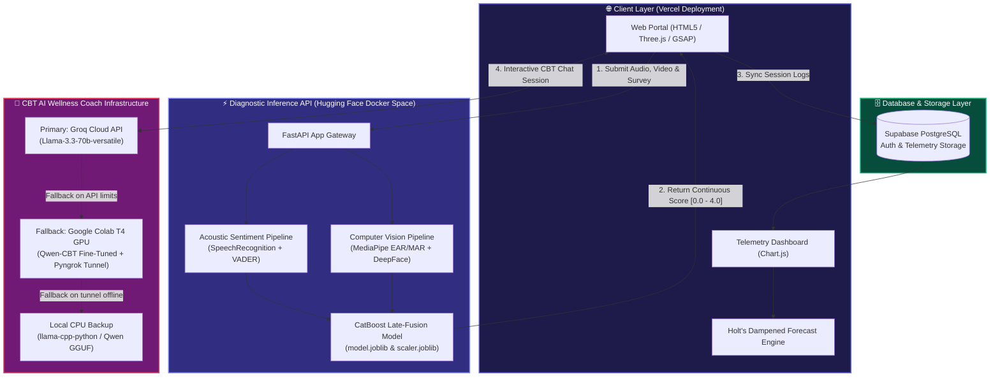
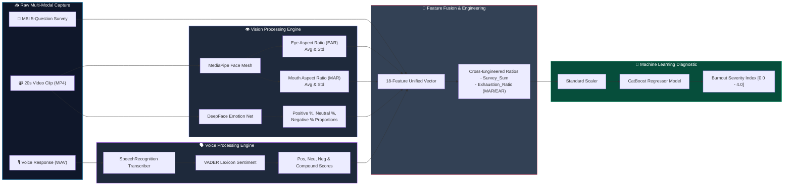
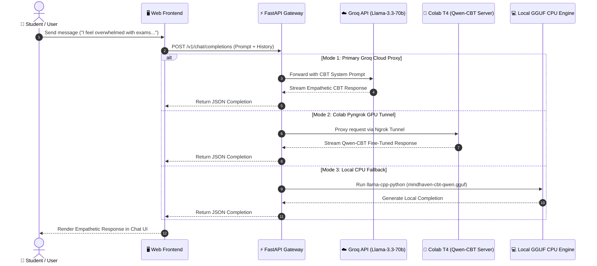

<div align="center">

# 🧠 MindHaven

### *Objective, Continuous Student Burnout Diagnostics Powered by Psychometric, Computer Vision, and Acoustic AI Multi-Modal Late-Fusion*

<br/>

[](https://mind-haven-zeta.vercel.app)
[](https://kritika53245-mindhaven.hf.space)
[](#-diagnostic-machine-learning-model)

<br/>

[](https://www.python.org/)
[](https://fastapi.tiangolo.com/)
[](https://threejs.org/)
[](https://mediapipe.dev/)
[](https://github.com/serengil/deepface)
[](https://supabase.com/)
[](https://www.docker.com/)
[](LICENSE)

</div>

---

> [!IMPORTANT]
> **MindHaven** addresses student mental wellness by eliminating subjective self-reporting biases. By fusing **computer vision (eye & mouth aspect ratios, micro-expressions)**, **acoustic sentiment analysis**, and **psychometric surveys** in a 20-second biometric capture window, MindHaven predicts burnout severity with **95.76% $R^2$ accuracy** and provides an empathetic AI Cognitive Behavioral Therapy (CBT) wellness coach.

---

## 📸 Technical Demo & Live Interface

<div align="center">

[](https://www.youtube.com/watch?v=6wFkLPPiBBk)

*🌐 Active Live Web Deployment: **[mind-haven-zeta.vercel.app](https://mind-haven-zeta.vercel.app)** | ⚡ API Endpoint: **[kritika53245-mindhaven.hf.space](https://kritika53245-mindhaven.hf.space)***

</div>

---

## 🌟 Key Features

| Feature | Description | Tech / Stack |
| :--- | :--- | :--- |
| 📝 **Psychometric Baseline** | 5-question psychometric survey mapped directly to Maslach Burnout Inventory (MBI) sub-scales. | Vanilla JS / Custom Form |
| 👁️ **Ocular & Facial Biomarkers** | Real-time calculation of Eye Aspect Ratio (**EAR**) & Mouth Aspect Ratio (**MAR**) for fatigue/yawning detection. | OpenCV, MediaPipe Face Mesh |
| 🎭 **Micro-Expression Analytics** | Real-time classification of positive, neutral, and negative facial emotion proportions across video frames. | DeepFace (CNN) |
| 🗣️ **Acoustic Sentiment Engine** | WebRTC audio stream transcription paired with lexicon-based polarity compound scoring. | SpeechRecognition, VADER |
| 🧠 **Multi-Modal Regression** | Pre-trained late-fusion **CatBoost Regressor** outputting a continuous burnout index (`0.0` to `4.0`). | CatBoost, Scikit-Learn |
| 💬 **AI CBT Wellness Coach** | Empathetic non-clinical cognitive behavioral therapy dialogue agent with dual-mode API routing. | Groq (Llama-3.3-70b) / Qwen-CBT GGUF |
| 📈 **Dampened Forecast Engine** | 7-day predictive trajectory forecasting using client-side dampened exponential smoothing ($\phi = 0.85$). | Holt's Dampened Model, Chart.js |
| 🎨 **Immersive 3D Experience** | Dynamic dark/light design system with 3D canvas particle visualizer and glassmorphism UI. | Three.js, GSAP, CSS3 |

---

## 🚀 System Architecture

MindHaven utilizes a resilient hybrid cloud topology engineered for low-latency client interaction, secure inference execution, and dynamic LLM fallback options:


```mermaid
flowchart TB
    subgraph ClientLayer["🌐 Client Layer (Vercel Deployment)"]
        UI["Web Portal (HTML5 / Three.js / GSAP)"]
        Dashboard["Telemetry Dashboard (Chart.js)"]
        ForecastEngine["Holt's Dampened Forecast Engine"]
    end

    subgraph StorageLayer["🗄️ Database & Storage Layer"]
        SupaDB[("Supabase PostgreSQL\nAuth & Telemetry Storage")]
    end

    subgraph DiagnosticLayer["⚡ Diagnostic Inference API (Hugging Face Docker Space)"]
        FastAPI["FastAPI App Gateway"]
        CVProcessor["Computer Vision Pipeline\n(MediaPipe EAR/MAR + DeepFace)"]
        AudioProcessor["Acoustic Sentiment Pipeline\n(SpeechRecognition + VADER)"]
        MLModel["CatBoost Late-Fusion Model\n(model.joblib & scaler.joblib)"]
    end

    subgraph LLMLayer["💬 CBT AI Wellness Coach Infrastructure"]
        GroqAPI["Primary: Groq Cloud API\n(Llama-3.3-70b-versatile)"]
        ColabServer["Fallback: Google Colab T4 GPU\n(Qwen-CBT Fine-Tuned + Pyngrok Tunnel)"]
        LocalGGUF["Local CPU Backup\n(llama-cpp-python / Qwen GGUF)"]
    end

    UI -->|"1. Submit Audio, Video & Survey"| FastAPI
    FastAPI --> CVProcessor
    FastAPI --> AudioProcessor
    CVProcessor --> MLModel
    AudioProcessor --> MLModel
    MLModel -->|"2. Return Continuous Score [0.0 - 4.0]"| UI
    UI -->|"3. Sync Session Logs"| SupaDB
    SupaDB --> Dashboard
    Dashboard --> ForecastEngine
    UI <-->|"4. Interactive CBT Chat Session"| GroqAPI
    GroqAPI -.->|"Fallback on API limits"| ColabServer
    ColabServer -.->|"Fallback on tunnel offline"| LocalGGUF

    style ClientLayer fill:#1e1b4b,stroke:#6366f1,stroke-width:2px,color:#fff
    style StorageLayer fill:#064e3b,stroke:#10b981,stroke-width:2px,color:#fff
    style DiagnosticLayer fill:#312e81,stroke:#818cf8,stroke-width:2px,color:#fff
    style LLMLayer fill:#701a75,stroke:#f43f5e,stroke-width:2px,color:#fff
```

---

## 🔬 Multi-Modal Late-Fusion Dataflow Pipeline

The diagram below illustrates how raw multi-modal biometric inputs are converted into processed feature channels during the **20-second capture window** before being fused into an 18-element feature vector for continuous regression:


```mermaid
flowchart LR
    subgraph Inputs["📥 Raw Multi-Modal Capture"]
        Video["📹 20s Video Clip (MP4)"]
        Audio["🎙️ Voice Response (WAV)"]
        Survey["📝 MBI 5-Question Survey"]
    end

    subgraph CVExtractor["👁️ Vision Processing Engine"]
        MP["MediaPipe Face Mesh"]
        EAR["Eye Aspect Ratio (EAR)\nAvg & Std"]
        MAR["Mouth Aspect Ratio (MAR)\nAvg & Std"]
        DF["DeepFace Emotion Net"]
        Emotions["Positive %, Neutral %,\nNegative % Proportions"]
    end

    subgraph AcousticExtractor["🗣️ Voice Processing Engine"]
        SR["SpeechRecognition Transcriber"]
        VADER["VADER Lexicon Sentiment"]
        SentMetrics["Pos, Neu, Neg & Compound Scores"]
    end

    subgraph FeatureFusion["🧮 Feature Fusion & Engineering"]
        Vector["18-Feature Unified Vector"]
        CrossFeat["Cross-Engineered Ratios:\n- Survey_Sum\n- Exhaustion_Ratio (MAR/EAR)"]
    end

    subgraph MLInference["🧠 Machine Learning Diagnostic"]
        Scaler["Standard Scaler"]
        CatBoost["CatBoost Regressor Model"]
        Score["Burnout Severity Index [0.0 - 4.0]"]
    end

    Video --> MP & DF
    MP --> EAR & MAR
    DF --> Emotions
    Audio --> SR --> VADER --> SentMetrics
    Survey --> Vector
    EAR & MAR & Emotions & SentMetrics --> Vector
    Vector --> CrossFeat --> Scaler --> CatBoost --> Score

    style Inputs fill:#0f172a,stroke:#38bdf8,color:#fff
    style CVExtractor fill:#1e293b,stroke:#818cf8,color:#fff
    style AcousticExtractor fill:#1e293b,stroke:#a855f7,color:#fff
    style FeatureFusion fill:#334155,stroke:#f43f5e,color:#fff
    style MLInference fill:#064e3b,stroke:#34d399,color:#fff
```

---

## 🧠 Diagnostic Machine Learning Model

MindHaven replaces qualitative self-assessments with a late-fusion continuous regression pipeline trained on empirical student datasets.

> [!NOTE]
> The model extracts high-accuracy statistical parameters across **18 distinct features** during the inference pipeline:

### 1. Extracted & Engineered Feature Dictionary

| Category | Feature Name | Description | Mathematical / Logic Source |
| :--- | :--- | :--- | :--- |
| **Psychometrics** | `Q1_inv`, `Q4_inv`, `Q5_inv` | Inverted survey questions (Exhaustion, Pride, Outcomes) | $\text{Q\_inv} = 4 - \text{Q\_raw}$ |
| **Psychometrics** | `Q2`, `Q3` | Direct Likert scale responses (Overwhelm, Stress) | Raw scale $[0 - 4]$ |
| **Computer Vision** | `Avg_EAR`, `Std_EAR` | Mean & standard deviation of Eye Aspect Ratio | Blinking dynamics & drowsiness |
| **Computer Vision** | `Avg_MAR`, `Std_MAR` | Mean & standard deviation of Mouth Aspect Ratio | Jaw tension & yawning frequency |
| **Micro-Expressions** | `Positive_Percent`, `Neutral_Percent`, `Negative_Percent` | Frame-by-frame emotion distributions | DeepFace classification proportions |
| **Acoustic Sentiment** | `Sentiment_Pos`, `Sentiment_Neu`, `Sentiment_Neg`, `Sentiment_Comp` | Speech transcription sentiment polarity | VADER compound score $[-1.0, 1.0]$ |
| **Cross-Engineering** | `Survey_Sum` | Aggregated raw psychometric score | $\text{Survey}_{\text{Sum}} = (4 - \text{Q1}_{\text{inv}}) + \text{Q2} + \text{Q3} + \text{Q4}_{\text{inv}} + \text{Q5}_{\text{inv}}$ |
| **Cross-Engineering** | `Exhaustion_Ratio` | Ratio of oral tension to ocular fatigue | $\text{Exhaustion}_{\text{Ratio}} = \frac{\text{Avg}_{\text{MAR}}}{\text{Avg}_{\text{EAR}}}$ |

### 2. Model Performance Benchmarks (5-Fold Cross Validation)

The training pipeline was evaluated on empirical student records with Gaussian noise injection ($\sigma = 0.16$) to simulate real-world web-camera variance:

| Model Architecture | Mean $R^2$ Score | Mean RMSE | Mean MAE | Status |
| :--- | :---: | :---: | :---: | :---: |
| 🏆 **CatBoost Regressor (Production)** | **95.76%** | **0.1727** | **0.1378** | **Selected** |
| 🌲 Random Forest Regressor | 95.32% | 0.1805 | 0.1444 | Evaluated |
| 📈 Support Vector Regressor (SVR) | 92.95% | 0.2227 | 0.1719 | Evaluated |

---

## 📈 Predictive Trendline Forecasting

To provide realistic stress forecasts without numerical divergence, MindHaven implements client-side **Holt's Dampened Exponential Smoothing**:


```mermaid
flowchart LR
    A["📅 Raw Historical Telemetry"] --> B["1. Daily Group Aggregation (YYYY-MM-DD)"]
    B --> C["2. Recency Weighting & Level Smoothing"]
    C --> D["3. Dampened Extrapolation (ϕ = 0.85)"]
    D --> E["4. Anchor to Y_last (No Jumps)"]
    E --> F["📊 7-Day Trajectory Forecast Plotted"]

    style A fill:#1e1b4b,stroke:#6366f1,color:#fff
    style B fill:#1e293b,stroke:#38bdf8,color:#fff
    style C fill:#1e293b,stroke:#a855f7,color:#fff
    style D fill:#334155,stroke:#f43f5e,color:#fff
    style E fill:#064e3b,stroke:#10b981,color:#fff
    style F fill:#047857,stroke:#34d399,color:#fff
```

### Dampened Extrapolation Equation

$$\text{Forecast}(h) = Y_{\text{last}} + \left( \sum_{k=1}^{h} \phi^k \right) \times \text{Final Daily Trend}$$

*Where $\phi = 0.85$ ensures the forecast curve smoothly flattens over a 7-day horizon, preventing artificial runaway projections.*

---

## 💬 Dual-Mode CBT Wellness AI Agent

MindHaven includes an empathetic Cognitive Behavioral Therapy assistant reachable via `/v1/chat/completions`:


```mermaid
sequenceDiagram
    autonumber
    actor User as 👤 Student / User
    participant Client as 🖥️ Web Frontend
    participant API as ⚡ FastAPI Gateway
    participant Groq as ☁️ Groq API (Llama-3.3-70b)
    participant Colab as 🚀 Colab T4 (Qwen-CBT Server)
    participant Local as 💻 Local GGUF CPU Engine

    User->>Client: Send message ("I feel overwhelmed with exams...")
    Client->>API: POST /v1/chat/completions (Prompt + History)
    
    alt Mode 1: Primary Groq Cloud Proxy
        API->>Groq: Forward with CBT System Prompt
        Groq-->>API: Stream Empathetic CBT Response
        API-->>Client: Return JSON Completion
    else Mode 2: Colab Pyngrok GPU Tunnel
        API->>Colab: Proxy request via Ngrok Tunnel
        Colab-->>API: Stream Qwen-CBT Fine-Tuned Response
        API-->>Client: Return JSON Completion
    else Mode 3: Local CPU Fallback
        API->>Local: Run llama-cpp-python (mindhaven-cbt-qwen.gguf)
        Local-->>API: Generate Local Completion
        API-->>Client: Return JSON Completion
    end

    Client-->>User: Render Empathetic Response in Chat UI
```

---

## 📁 Project Structure

```
MindHaven/
├── 📂 frontend/               # Static Web Portal & Dashboards (Vercel Deployed)
│   ├── 📂 css/                # Custom design system & glassmorphism stylesheets
│   ├── 📂 js/                 # Client logic modules
│   │   ├── 📜 3d-elements.js  # Three.js 3D dynamic visual background
│   │   ├── 📜 config.js       # Local configuration overrides (git-ignored)
│   │   ├── 📜 theme.js        # Light/Dark dynamic theme controller
│   │   └── 📜 utils.js        # Supabase client hooks & API helpers
│   ├── 📜 index.html          # Portal home landing page
│   ├── 📜 auth.html           # Authentication interface
│   ├── 📜 assess.html         # Multimodal capture interface
│   ├── 📜 insights.html       # AI CBT Wellness Coach interface
│   ├── 📜 dashboard.html      # Telemetry analytics & trend forecast dashboard
│   ├── 📜 breathe.html        # Interactive guided breathing recovery module
│   └── 📜 about.html          # Scientific methodology overview
│
├── 📂 backend/                # Production FastAPI Backend (Hugging Face Docker)
│   ├── 📜 Dockerfile          # HF Docker deployment definition
│   ├── 📜 main.py             # FastAPI REST endpoints & inference logic
│   ├── 📜 model.joblib        # Pre-trained CatBoostRegressor model artifact
│   ├── 📜 scaler.joblib       # Standard Scaler preprocessing artifact
│   ├── 📜 requirements.txt    # Backend Python dependencies
│   └── 📜 .gitattributes      # Git LFS tracking configuration
│
├── 📂 model_training/         # Data Science & Model Fine-Tuning
│   ├── 📜 data.csv            # Empirical VIT student burnout dataset
│   ├── 📜 Model_Training_Regression.ipynb # Full ML training & cross-validation notebook
│   └── 📂 regression_output/  # Serialized model export artifacts
│
└── 📂 chatbot_finetuning/     # CBT LLM Fine-Tuning & Colab Server
    ├── 📜 MindHaven_CBT_FineTuning.ipynb # Unsloth Qwen-1.5B CBT fine-tuning
    └── 📜 COLAB_NGROK_SETUP.md # Google Colab T4 Pyngrok deployment guide
```

---

## 🔌 REST API Specification

### Base URL
- **Production**: `https://kritika53245-mindhaven.hf.space`
- **Local**: `http://localhost:7860`

### Core Endpoints

| Method | Endpoint | Description | Auth / Format |
| :--- | :--- | :--- | :--- |
| `POST` | `/predict` | Evaluates video, audio, and survey to return burnout index | `multipart/form-data` |
| `POST` | `/v1/chat/completions` | Empathetic CBT Chatbot completion proxy | `application/json` |
| `GET` | `/health` | Diagnostic status check endpoint | None |

#### Example Request (`POST /predict`)

```bash
curl -X POST "https://kritika53245-mindhaven.hf.space/predict" \
  -F "video_file=@sample_video.mp4" \
  -F "audio_file=@sample_audio.wav" \
  -F "answer_1=Sometimes" \
  -F "answer_2=Often" \
  -F "answer_3=Sometimes" \
  -F "answer_4=Often" \
  -F "answer_5=Sometimes"
```

#### Example Response JSON

```json
{
  "burnout_score": 2.5412,
  "suggestion": "Your burnout score is Moderate (40-60). You're starting to feel physical and emotional exhaustion...",
  "debug_data": {
    "Questionnaire Answers": ["Sometimes", "Often", "Sometimes", "Often", "Sometimes"],
    "EAR": "0.24 ± 0.03",
    "MAR": "0.16 ± 0.02",
    "Emotions": { "Positive %": "10.5%", "Neutral %": "62.4%", "Negative %": "27.1%" },
    "Voice Transcript": "I am feeling quite tired lately...",
    "Sentiment": "Pos: 0.12, Neu: 0.65, Neg: 0.23, Comp: -0.21"
  }
}
```

---

## 🛠️ Local Setup & Installation

### Prerequisites
- Python 3.10+
- Git & Git LFS
- Node.js or simple Python HTTP server

### 1. Clone Repository & Setup Backend

```bash
# Clone the repository
git clone https://github.com/kritika-ghosh/MindHaven.git
cd MindHaven

# Navigate to backend
cd backend

# Create virtual environment
python -m venv .venv

# Activate environment
# On Windows:
.venv\Scripts\activate
# On macOS/Linux:
source .venv/bin/activate

# Install dependencies
pip install -r requirements.txt

# Start FastAPI dev server
uvicorn main:app --host 0.0.0.0 --port 7860 --reload
```

### 2. Launch Client Portal

```bash
# In a new terminal tab, navigate to frontend
cd frontend

# Start local web server
python -m http.server 8000
```
Open **`http://localhost:8000`** in your browser to access MindHaven locally!

---

## 🤝 Contributing

Contributions make the open-source community an inspiring place to learn, create, and innovate. Any contributions you make are **greatly appreciated**!

1. Fork the Project.
2. Create your Feature Branch (`git checkout -b feat/AmazingFeature`).
3. Commit your Changes using [Conventional Commits](https://www.conventionalcommits.org/) (`git commit -m 'feat: Add some AmazingFeature'`).
4. Push to the Branch (`git push origin feat/AmazingFeature`).
5. Open a Pull Request.

---

## 📄 License

Distributed under the **MIT License**. See [`LICENSE`](LICENSE) for more details.

---

<div align="center">

Made with ❤️ by **[Kritika Ghosh](https://github.com/kritika-ghosh)**

*MindHaven — Nurturing Student Resilience through Multi-Modal Intelligence*

</div>
