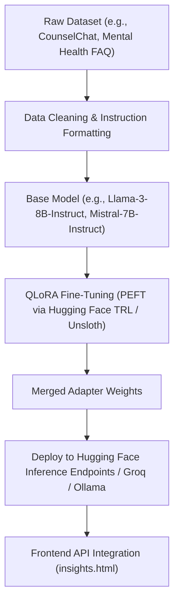

# Implementation Plan — AI Mental Health Chatbot Integration

Add an interactive, context-aware AI Chatbot feature to the Insights Hub page ([insights.html](file:///d:/Desktop/projects/burnout_hackathon/frontend/insights.html)) to allow users to discuss their burnout results, mental state, and coping strategies with an empathetic LLM.

---

## Technical Architecture & Methodology

### 1. Fine-Tuning & Transfer Learning for Mental Health LLMs
To address the user's question about how to fine-tune a model on medical/mental health data (transfer learning):



#### How to implement true offline Fine-Tuning:
1. **Dataset Selection**: Use open-source datasets like:
   - **`CounselChat`**: Real therapist responses to anonymous user questions.
   - **`mental_health_conversations`**: Instructions designed for empathetic support.
2. **Transfer Learning / QLoRA**:
   - Instead of training all billions of parameters, use **QLoRA** (Quantized Low-Rank Adaptation) to train low-rank adapters (PEFT). This is fast, cheap, and prevents catastrophic forgetting.
   - Use Hugging Face's `transformers` and `trl` library with a script like:
     ```python
     from trl import SFTTrainer
     from peft import LoraConfig
     # Set up trainer on Mistral-7B or Llama-3-8B with LoRA adapters
     trainer = SFTTrainer(
         model=model,
         train_dataset=dataset,
         peft_config=LoraConfig(r=8, lora_alpha=16, target_modules=["q_proj", "v_proj"]),
         max_seq_length=512,
     )
     trainer.train()
     ```
3. **Deployment**:
   - Host the resulting weights on Hugging Face Hub as an adapter.
   - Deploy as a serverless container using **Hugging Face Inference Endpoints** or a server hosting **Ollama** / **vLLM**.
   - In the frontend, change the Fetch endpoint from `api.groq.com` to your Hugging Face endpoint.

---

### 2. Sandbox Integration (Groq + Context Injection)
For this hackathon, we will implement the chatbot using the **Groq API** (`llama3-8b-8192` for sub-second streaming/chat speed). To make it perform like a specialized mental health model:
- **Context Injection**: We will extract the user's latest biometric data (burnout score, EAR/MAR ratios, expressions, and speech transcripts) from Supabase or localStorage and inject it into the chatbot's system prompt context. The chatbot will know exactly *how* the user is feeling before they even send their first message.
- **Specialized System Prompt**: 
  > *“You are MindHaven-CBT, an empathetic AI therapist trained in Cognitive Behavioral Therapy (CBT). You have access to the user's latest biometric data. Address their stress levels with validation, mindfulness exercises, and practical coping mechanisms. NEVER give diagnostic medical advice, and provide crisis support resources if severe distress is detected.”*

---

## Proposed Changes

### AI Insights Hub
#### [MODIFY] [insights.html](file:///d:/Desktop/projects/burnout_hackathon/frontend/insights.html)
- **HTML Structure**:
  - Add a collapsible floating chat widget in the bottom-right corner.
  - The widget will contain a header (with minimize button), a messages container (custom scrollable area), and a text input form (input, send button, state indicators).
- **CSS Styles**:
  - Implement premium glassmorphic styling matching the application's overall design system:
    ```css
    .chat-widget {
        background: rgba(255, 255, 255, 0.45);
        backdrop-filter: blur(20px);
        border: 1.5px solid rgba(255, 255, 255, 0.6);
        box-shadow: 0 12px 40px rgba(107, 56, 212, 0.15);
    }
    ```
- **JavaScript Chat Logic**:
  - Define `chatHistory` array to maintain conversation state.
  - Implement `toggleChat()` to open/minimize the chat window using GSAP animations.
  - Implement `initChatContext(predictionData)`: Automatically reads latest biometric parameters to construct the starting system prompt.
  - Implement `sendMessage(event)`:
    - Capture input, append to UI as user bubble.
    - Send API POST request to Groq (`llama3-8b-8192` for fast, lightweight conversation).
    - Handle API loading states (dots pulsing animation).
    - Append assistant reply bubble in UI.
    - Automatically scroll chat to bottom.

---

## Verification Plan

### Manual Verification
1. **UI Layout**:
   - Verify the presence of the chatbot bubble in the bottom-right corner of the Insights page.
   - Click it to ensure it opens and closes smoothly using GSAP.
2. **Context Seeding**:
   - Take an assessment (or load Guest Demo data on the Dashboard and click "Inspect").
   - Open the chat. Ask the AI: *"What do my facial tension scores mean?"*
   - Verify that the AI knows the exact MAR/EAR metrics and burnout category from the latest session.
3. **Conversational Tone**:
   - Ask the AI: *"I feel very overwhelmed with my exams."*
   - Verify that the response uses empathetic, CBT-focused coping strategies.
4. **Security Check**:
   - Verify that it uses the secure `GROQ_KEY` from `js/config.js` and warns the user if it's missing.
